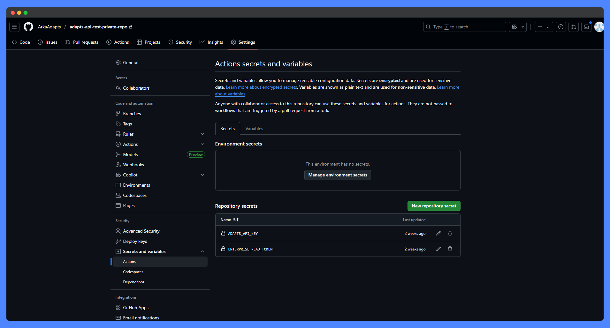
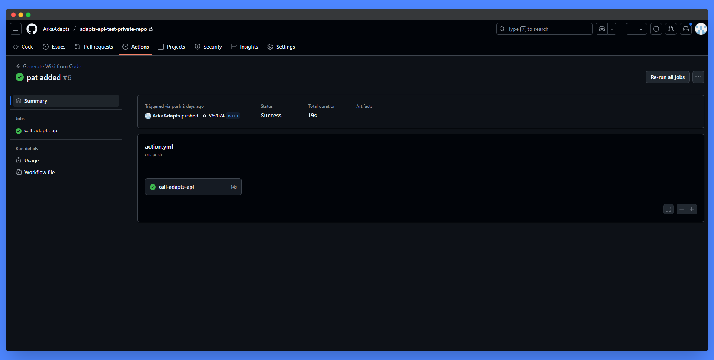
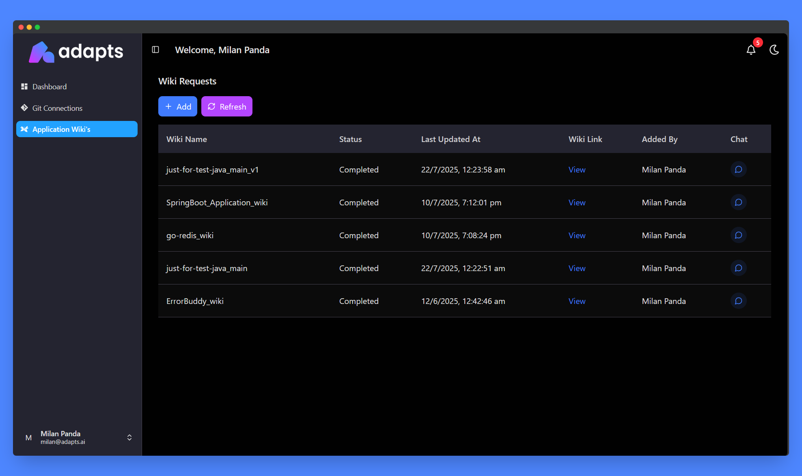

<p align="center">
  <picture>
    <source srcset="./images/logo-dark.png" media="(prefers-color-scheme: dark)" />
    <source srcset="./images/logo-light.png" media="(prefers-color-scheme: light)" />
    
  </picture>
</p>
<h1 align="center">Code to Wiki</h1>
<p align="center">
  Automatically generates Wiki-style documentation in <code>@adapts.wiki</code><br/>
  every time a pull-request is merged into <code>main</code>.
</p>

---

## 📖 What the workflow does

<!-- <p align="center">
  
</p> -->

<p align="center">
```mermaid
flowchart LR
  A[Add <code>.github/action.yml</code> to your repo] --> B[Merge a PR into <code>main</code>]
  B --> C[GitHub Action runs &amp; calls Adapts API]
  C --> D[✅ Check run status in the **Actions** tab]
  C --> E[View detailed request status on adapts.app]

</p>

| Stage                    | Purpose                                                                                                                                                                                                        |
| ------------------------ | -------------------------------------------------------------------------------------------------------------------------------------------------------------------------------------------------------------- |
| **Checkout / Setup**     | Fetches your repo and installs Python 3.11 plus runtime dependencies (`requests`, `adaptsapi`).                                                                                                                |
| **Author e-mail lookup** | Uses GitHub’s GraphQL API to obtain the PR author’s **organisation-verified e-mail** (Enterprise Cloud feature). Falls back to the head-commit author e-mail if needed.                                       |
| **Repo intel**           | Calculates repository size in bytes (for metadata) and determines dominant language.                                                                                                                           |
| **Adapts API call**      | Sends a signed request to Adapts’ `/generate_wiki_docs` endpoint so the service can pull the code and build Wiki pages.                                                                                        |

---

## ⚡ Quick-start

1. **Copy the workflow file**  
   Save [`.github/action.yml`](./action.yml) into your own repo under the same path.

2. **Add required secrets**  
   Go to *Settings ▸ Secrets and variables ▸ Actions* and add:

   | Secret                  | Where to get it                              |
   | ----------------------- | -------------------------------------------- |
   | `ADAPTS_API_KEY`        | Request from <contact@adapts.ai>             |
   | `ENTERPRISE_READ_TOKEN` | Fine-grained PAT (org admin) **or** GitHub App installation token |

   <details>
   <summary><strong>SSO note</strong></summary>
   If your org enforces SAML/OIDC SSO, remember to **authorise** the PAT after creating it.
   </details>

   <p align="center">
     
   </p>

3. **Verify domain settings**  
   Ensure your org has **verified its corporate e-mail domain** and each developer has added that address to GitHub.

4. **Push or merge a PR**  
   Merge into `main` and watch for a ✅ Success log entry:

   <p align="center">
     
   </p>

---

## ⚙️ Environment Variables

| Name                       | Source                         | Purpose                                          |
| -------------------------- | ------------------------------ | ------------------------------------------------ |
| `GH_TOKEN`                 | `ENTERPRISE_READ_TOKEN` secret | Used by `gh` CLI for GraphQL calls               |
| `ADAPTS_API_KEY`           | Secret                         | Bearer token for Adapts AI API                   |
| GitHub defaults (`GITHUB_…`)| Provided by Actions            | Context for repo, actor, etc.                    |

---

## 🛠️ Customisation Tips

- **Target branch**: edit `on.pull_request.branches`.  
- **Monorepos**: document sub-directories by filtering or passing extra metadata.  
- **Non-Enterprise orgs**: remove GraphQL step and rely on commit e-mails.  
- **Self-hosted runners**: install the GitHub CLI or add an explicit install step.

---

## 🐞 Troubleshooting

| Symptom                                                           | Likely cause                              | Fix                                                                                   |
| ----------------------------------------------------------------- | ----------------------------------------- | ------------------------------------------------------------------------------------- |
| `gh: Expected NAME, actual: UNKNOWN_CHAR`                         | Multiline GraphQL passed incorrectly      | Keep the query on **one line**                                                       |
| `organizationVerifiedDomainEmails` unavailable                    | Non-Enterprise plan                       | Remove this step or migrate to Enterprise Cloud                                       |
| API returns `401`                                                 | Missing/invalid `ADAPTS_API_KEY`          | Re-issue key in Adapts AI console                                                     |
| Author e-mail is `noreply@users.github.com`                       | Developer hasn’t added corporate e-mail   | Ask them to add it via GitHub Profile ▸ Emails                                       |

---

## 🔐 Security considerations

- Tokens are **read-only** and never leave GitHub infra.  
- Only **metadata** (URL, size, language) is sent to Adapts AI.  
- Source code is fetched by Adapts AI via the provided GitHub token.

---

## 🌐 Accessing your Wiki

1. Visit [adapts.app](https://adapts.app)  
2. **Log in** with the **same e-mail** you use on GitHub  
3. Navigate to **Application Wiki's** ➡️ **Your Repo Name**  ➡️ **Click on View**  
4. Enjoy your freshly generated Wiki!

<p align="center">
  
</p>

---

## ❓ Support / Questions

Open an issue in this repo or email <support@adapts.ai> with your workflow logs (mask secrets) and we’ll help you get set up.

---

_Ready to give it a spin? Merge into `main` and watch your docs appear!_  
