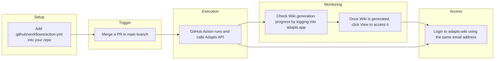

  <picture>
    
  </picture>

<h1 align="center">Adapts</h1>

  Chat with your wikis straight from your IDE &nbsp;·&nbsp; Auto-generate Wiki-style docs on every merge 
  <a href="https://adapts.wiki" target="_blank">adapts.wiki</a> &nbsp;|&nbsp; <a href="https://adapts.app" target="_blank">adapts.app</a>

---

## Contents

- [Latest Releases](#latest-releases)
- [Getting Started — Chat Assistant](#getting-started--chat-assistant)
  - [IntelliJ](#intellij)
  - [Cursor](#cursor)
  - [VSCode](#vscode)
  - [How To Use The Assistant](#how-to-use-the-adapts-assistant)
- [Wiki Generation — Code to Wiki](#wiki-generation--code-to-wiki)
  - [What the workflow does](#what-the-workflow-does)
  - [Quick-start](#quick-start)
  - [Customisation Tips](#customisation-tips)
  - [Troubleshooting](#troubleshooting)
  - [Security Considerations](#security-considerations)
  - [Accessing your Wiki](#accessing-your-wiki)
  - [Support / Questions](#support--questions)

---

## 🚀 Latest Releases

<strong>Context Enhancement: Multi-wiki chat context</strong>

### What's new

_Context Enhancement: Users can now choose upto 3 different wikis to include in their assistant's chat context to get more relevant output._

### Why did we add this? 

With an even wider context it will be easier for 
> Developers to avoid things like breaking API contracts and duplicating business logic across services 
> Architects to avoid architecture drift and cross-service tight coupling

### Scope

This is limited to the web app in the absence of future updates after February 25, 2026. 
This feature will not be applicable to old conversations. 

### How to use

1. Open a new chat conversation. The wiki selection dropdown now says "Select one of more wikis."

   

3. If you know your wiki names you can type its name to search and select, as show below

   

  Or, you can hover over service names to choose the wiki(s) you want to include as below

  

4. Once you choose your wikis and model, you can continue as usual. 

 

<strong>Documentation Improvement: Workflow Visualizations</strong> 

### What's New 

_Adapts Code-to-Wiki now traces workflows from entry points through all functions, inputs, and outputs within repositories_

### Why did we add this?

**Feature Sunsetting & Migration** Developers can now identify all components involved in specific features, making it easier to plan modernization efforts and ensure no business logic is missed during migrations.
**Technical Debt Cleanup** Developers can discover dead code—functions and classes that aren't referenced in any workflows—so you can safely remove unused code without business impact.
**Architecture Understanding** Architects can gain clear visibility into how your application works at a detailed level, helping developers and product managers understand complex workflows across your entire repository

---

## 💬 Getting Started — Chat Assistant

Chat with your wikis straight from your IDE.

### Plugins

1. [IntelliJ](#intellij)
2. [Cursor](#cursor)
3. [VSCode](#vscode)
4. [How To Use The Assistant](#how-to-use-the-adapts-assistant)

---

### IntelliJ

IntelliJ IDE should be on the version: 2025 +

Browsers: Chrome and Edge

#### Plugin Installation for IntelliJ

1. Go to Setting Icon. Click on the Plugins option on the IntelliJ platform.

 

2. Go to Marketplace option and search "Adapts Assistant".

3. Click "Apply" and then "Ok".

4. You will start seeing the Adapts icon on the left side panel. Click on it and the Login/signup screen will appear.

#### Account Setup

> ⚠️ Mac Users, please choose **Chrome** as your default browser before beginning the login process.

1. You will start seeing the Adapts icon on the left side panel. Click on it and the Login/signup screen will appear.

2. Your admin should have added you as a user.

- You can go straight to sign-in to access your adapts account.
- Otherwise, click on the Sign Up option, and choose your SSO provider.

**NOTE:**

During the log-in you may see this dialogue box on the screen. Click on Allow.

If you don't see the above dialog and the authentication still fails, then:

1. Click on the Lock icon in the address bar.
2. Check Permissions for this site.
3. Make sure Local network access is set to Allowed.
4. After this is done, close this window and re-login.

You should see the following notification at the center of your browser screen. You can now continue to IntelliJ

---

### Cursor

#### Plugin Installation for Cursor

1. Click on the Marketplace Icon at the top of the left panel.

2. Once in the marketplace, search "Adapts Assistant".

3. Scroll down until you find the Adapts listing and click install.

#### Account Setup

> ⚠️ Mac Users, please choose **Chrome** as your default browser before beginning the sign-in/sign-up process.

1. You will start seeing the Adapts icon in the left panel's dropdown . Click on it and the Login/signup screen will appear.

↓

3. Your admin should have added you as a user.

- You can go straight to sign-in to access your adapts account.
- Otherwise, click on the Sign Up option, and choose your SSO provider.

**NOTE:**

During the log-in you may see this dialogue box on the screen. Click on Allow.

If you don't see the above dialog and the authentication still fails, then:

1. Click on the Lock icon in the address bar.
2. Check Permissions for this site.
3. Make sure Local network access is set to Allowed.
4. After this is done, close this window and re-login.

You should see the following notification at the center of your browser screen. You can now continue to Cursor

---

### VSCode

#### Plugin Installation for VSCode

1. Click on the Marketplace Icon in the left panel.

2. Once in the marketplace, search "Adapts". The Adapts app should be the first search result. Click on install.

#### Account Setup

> ⚠️ Mac Users, please choose **Chrome** as your default browser before beginning the sign-in/sign-up process.

1. You will start seeing the Adapts icon in the left panel. Click on it and the Login/signup screen will appear.

↓

3. Your admin should have added you as a user.

- You can go straight to sign-in to access your adapts account.
- Otherwise, click on the Sign Up option, and choose your SSO provider.

**NOTE:**

During the log-in you may see this dialogue box on your browser screen. Click on Allow.

If you don't see the above dialog and the authentication still fails, then:

1. Click on the Lock icon in the address bar.
2. Check Permissions for this site.
3. Make sure Local network access is set to Allowed.
4. After this is done, close this window and re-login.

You should see the following notification at the center of your browser screen. You can now continue to Visual Studio Code

---

### How to use the Adapts Assistant

Once logged in, you should see a chat window.

1. In the top left corner of the chat window, click on Select wiki dropdown to set the context for any QnA by choosing one of the wikis generated by adapts.

2. Select the wiki you are interested in and ask questions about anything in it.

After selecting the wiki, you will see the screen below.
You can:

- Ask questions
- Change LLM Model

Additionally, you can also use the buttons hightlighted below to:

- View Repo
- View Wiki

> ⚠️ As of version 1.0.4, you may choose one wiki in every chat. If you would like to ask questions about a new wiki, you will need to start a new chat. We are currently wokring on
> releasing to allow multi-wiki selection in the same chat.

Right above the chat window, you can see options to:

- Start a new chat
- View chat history
- Change settings
- Logout

Congratulations! you're all set!

For further feedback please contact support@adapts.ai

---

## 📖 Wiki Generation — Code to Wiki

Automatically generates Wiki-style documentation in [adapts.wiki](https://adapts.wiki) every time a pull-request is merged into `main`.

### What the workflow does

```mermaid
flowchart LR
    %% Subgraph definitions
    subgraph Setup
        A[Add .github/workflows/action.yml into your repo]
    end
    subgraph Trigger
        B[Merge a PR in main branch]
    end
    subgraph Execution
        C[GitHub Action runs and calls Adapts API]
    end
    subgraph Monitoring
        D[Check Wiki generation progress by logging into adapts.app]
        E[Once Wiki is generated, click View to access it]
    end
    subgraph Access
        F[Login to adapts.wiki using the same email address]
    end

    %% Flow connections
    A --> B --> C
    C --> D
    D --> E
    E --> F
    C --> F

    class A setup
    class B trigger
    class C exec
    class D,E monitor
    class F access

```

| Stage                    | Purpose                                                                                                                                                                                                        |
| ------------------------ | -------------------------------------------------------------------------------------------------------------------------------------------------------------------------------------------------------------- |
| **Checkout / Setup**     | Fetches your repo and installs Python 3.11 plus runtime dependencies (`requests`, `adaptsapi`).                                                                                                                |
| **Author e-mail lookup** | Uses GitHub's GraphQL API to obtain the PR author's **organisation-verified e-mail** (Enterprise Cloud feature). Falls back to the head-commit author e-mail if needed.                                       |
| **Repo intel**           | Calculates repository size in bytes (for metadata) and determines dominant language.                                                                                                                           |
| **Adapts API call**      | Sends a signed request to Adapts' `/generate_wiki_docs` endpoint so the service can pull the code and build Wiki pages.                                                                                        |

---

### ⚡ Quick-start

1. **Signup for Adapts: Code to Wiki**
   Signup at [`adapts.app`](https://adapts.app) with your github email address.

2. **Copy the workflow file**
   Save [`.github/workflows/action.yml`](./action.yml) into your own repo under the same path.

3. **Add required secrets**
   Go to *Settings ▸ Secrets and variables ▸ Actions* and add:

   | Secret                  | Where to get it                              |
   | ----------------------- | -------------------------------------------- |
   | `ADAPTS_API_KEY`        | Request from <contact@adapts.ai>             |
   | `ENTERPRISE_READ_TOKEN` | Fine-grained PAT (org admin) **or** GitHub App installation token |

   

   
<strong>SSO note</strong>

   If your org enforces SAML/OIDC SSO, remember to <strong>authorise</strong> the PAT after creating it.
   

   For detailed instructions on adding secrets, see the [official GitHub documentation on using secrets in GitHub Actions](https://docs.github.com/en/actions/how-tos/writing-workflows/choosing-what-your-workflow-does/using-secrets-in-github-actions).

4. **Verify domain settings**
   Ensure your org has **verified its corporate e-mail domain** and each developer has added that address to GitHub.

5. **Push or merge a PR**
   Merge into `main` and watch for a ✅ Success log entry.

---

<strong>⚙️ Environment Variables</strong>

| Name                       | Source                         | Purpose                                          |
| -------------------------- | ------------------------------ | ------------------------------------------------ |
| `GH_TOKEN`                 | `ENTERPRISE_READ_TOKEN` secret | Used by `gh` CLI for GraphQL calls               |
| `ADAPTS_API_KEY`           | Secret                         | Bearer token for Adapts AI API                   |
| GitHub defaults (`GITHUB_…`)| Provided by Actions            | Context for repo, actor, etc.                    |

---

### 🛠️ Customisation Tips

- **Target branch**: edit `on.pull_request.branches`.
- **Monorepos**: document sub-directories by filtering or passing extra metadata.
- **Non-Enterprise orgs**: remove GraphQL step and rely on commit e-mails.
- **Self-hosted runners**: install the GitHub CLI or add an explicit install step.

---

### 🐞 Troubleshooting

| Symptom                                                           | Likely cause                              | Fix                                                                                   |
| ----------------------------------------------------------------- | ----------------------------------------- | ------------------------------------------------------------------------------------- |
| `gh: Expected NAME, actual: UNKNOWN_CHAR`                         | Multiline GraphQL passed incorrectly      | Keep the query on **one line**                                                       |
| `organizationVerifiedDomainEmails` unavailable                    | Non-Enterprise plan                       | Remove this step or migrate to Enterprise Cloud                                       |
| API returns `401`                                                 | Missing/invalid `ADAPTS_API_KEY`          | Re-issue key in Adapts AI console                                                     |
| Author e-mail is `noreply@users.github.com`                       | Developer hasn't added corporate e-mail   | Ask them to add it via GitHub Profile ▸ Emails                                       |

---

### 🔐 Security Considerations

- Tokens are **read-only** and never leave GitHub infra.
- Only **metadata** (URL, size, language) is sent to Adapts AI.
- Source code is fetched by Adapts AI via the provided GitHub token.

---

### 🌐 Accessing your Wiki

1. Visit [adapts.app](https://adapts.app)
2. **Log in** with the **same e-mail** you use on GitHub
3. Navigate to **Application Wiki's** ➡️ **Your Repo Name** ➡️ **Click on View**
4. Enjoy your freshly generated Wiki!

---

### ❓ Support / Questions

Open an issue in this repo or email <support@adapts.ai> with your workflow logs (mask secrets) and we'll help you get set up.

---

_Ready to give it a spin? Merge into `main` and watch your docs appear!_
