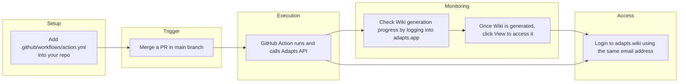

  <picture>
    
  </picture>

<h1 align="center">Adapts</h1>

  Chat with your wikis straight from your IDE &nbsp;·&nbsp; Auto-generate Wiki-style docs on every merge 
  <a href="https://adapts.wiki" target="_blank">adapts.wiki</a> &nbsp;|&nbsp; <a href="https://adapts.app" target="_blank">adapts.app</a>

---

## Contents

- [What is Adapts?](#what-is-adapts)
- [Getting Started — Chat Assistant](#getting-started-chat-assistant)
  - [Install the Plugin](#install-the-plugin)
  - [Account Setup](#account-setup)
  - [Using the Assistant](#how-to-use-the-adapts-assistant)
- [Wiki Generation — Code to Wiki](#wiki-generation--code-to-wiki)
  - [What the workflow does](#what-the-workflow-does)
  - [Quick-start](#quick-start)
  - [Customisation Tips](#customisation-tips)
  - [Troubleshooting](#troubleshooting)
  - [Security Considerations](#security-considerations)
  - [Accessing your Wiki](#accessing-your-wiki)
- [Latest Releases](#latest-releases)
- [Support / Questions](#support--questions)View the source repo or the generated wiki

---

## What is Adapts?

**Adapts** turns your codebase into living documentation — automatically.

- **Chat Assistant** — Ask questions about your codebase in natural language, right from IntelliJ, Cursor, or VSCode. Powered by wikis generated from your code.
- **Code to Wiki** — Every time a PR merges into `main`, a GitHub Action generates up-to-date Wiki-style documentation and publishes it to [adapts.wiki](https://adapts.wiki).

No context-switching. No stale docs. Just merge and go.

---

## 💬Getting Started Chat Assistant

Chat with your wikis straight from your IDE.

### Install the Plugin

| IDE | How to install | Min version | Latest Version |
| --- | -------------- | ----------- | ----------- | 
| **IntelliJ** | *Settings ▸ Plugins ▸ Marketplace* — search **"Adapts Assistant"** | 2025+ | 1.0.6
| **Cursor** | Marketplace panel — search **"Adapts Assistant"** | — | 0.0.3
| **VSCode** | Extensions panel — search **"Adapts"** | — | 0.0.3

<strong>IntelliJ — step-by-step screenshots</strong>

Browsers supported: Chrome and Edge

1. Go to the Settings icon. Click on the Plugins option.

2. Go to Marketplace and search "Adapts Assistant".

3. Click "Apply" and then "Ok".

4. The Adapts icon will appear on the left side panel.

<strong>Cursor — step-by-step screenshots</strong>

1. Click on the Marketplace icon at the top of the left panel.

2. Search "Adapts Assistant".

3. Find the Adapts listing and click install.

<strong>VSCode — step-by-step screenshots</strong>

1. Click on the Extensions icon in the left panel.

2. Search "Adapts" and click install.

---

### Account Setup

> ⚠️ **Mac users:** set **Chrome** as your default browser before beginning the login process.

1. Click the Adapts icon in your IDE's side panel. The Login/Signup screen will appear.

2. Your admin should have added you as a user.
   - Go straight to **Sign In** to access your account.
   - Otherwise, click **Sign Up** and choose your SSO provider.

**NOTE:**

During login you may see this dialog — click **Allow**.

If the dialog doesn't appear and authentication still fails:

1. Click the **Lock icon** in the address bar.
2. Check **Permissions for this site**.
3. Set **Local network access** to **Allowed**.
4. Close the window and re-login.

You should see this confirmation in your browser. You can now return to your IDE.

---

### How to use the Adapts Assistant

Once logged in, you should see a chat window.

1. Click the **Select wiki** dropdown (top-left of the chat window) to choose which wiki to query.

2. Select a wiki and start asking questions.

From here you can:

- Ask questions about the codebase
- Change the LLM model

- View the source repo or the generated wiki
  

The toolbar above the chat window lets you start a new chat, view history, change settings, or log out.

> ⚠️ On the plugins, you may choose one wiki per chat. To query a different wiki, start a new chat. Multi-wiki selection for richer context is available on the web app only at the moment.

You're all set! For feedback, contact <support@adapts.ai>.

---

## 📖 Wiki Generation — Code to Wiki

Automatically generates Wiki-style documentation in [adapts.wiki](https://adapts.wiki) every time a pull-request is merged into `main`.

### What the workflow does

```mermaid
flowchart LR
    %% Subgraph definitions
    subgraph Setup
        A[Add .github/workflows/action.yml into your repo]
    end
    subgraph Trigger
        B[Merge a PR in main branch]
    end
    subgraph Execution
        C[GitHub Action runs and calls Adapts API]
    end
    subgraph Monitoring
        D[Check Wiki generation progress by logging into adapts.app]
        E[Once Wiki is generated, click View to access it]
    end
    subgraph Access
        F[Login to adapts.wiki using the same email address]
    end

    %% Flow connections
    A --> B --> C
    C --> D
    D --> E
    E --> F
    C --> F

    class A setup
    class B trigger
    class C exec
    class D,E monitor
    class F access

```

| Stage                    | Purpose                                                                                                                                                                                                        |
| ------------------------ | -------------------------------------------------------------------------------------------------------------------------------------------------------------------------------------------------------------- |
| **Checkout / Setup**     | Fetches your repo and installs Python 3.11 plus runtime dependencies (`requests`, `adaptsapi`).                                                                                                                |
| **Author e-mail lookup** | Uses GitHub's GraphQL API to obtain the PR author's **organisation-verified e-mail** (Enterprise Cloud feature). Falls back to the head-commit author e-mail if needed.                                       |
| **Repo intel**           | Calculates repository size in bytes (for metadata) and determines dominant language.                                                                                                                           |
| **Adapts API call**      | Sends a signed request to Adapts' `/generate_wiki_docs` endpoint so the service can pull the code and build Wiki pages.                                                                                        |

---

### ⚡ Quick-start

1. **Signup for Adapts: Code to Wiki**
   Signup at [`adapts.app`](https://adapts.app) with your github email address.

2. **Copy the workflow file**
   Save [`.github/workflows/action.yml`](./action.yml) into your own repo under the same path.

3. **Add required secrets**
   Go to *Settings ▸ Secrets and variables ▸ Actions* and add:

   | Secret                  | Where to get it                              |
   | ----------------------- | -------------------------------------------- |
   | `ADAPTS_API_KEY`        | Request from <contact@adapts.ai>             |
   | `ENTERPRISE_READ_TOKEN` | Fine-grained PAT (org admin) **or** GitHub App installation token |

   

   
<strong>SSO note</strong>

   If your org enforces SAML/OIDC SSO, remember to <strong>authorise</strong> the PAT after creating it.
   

   For detailed instructions on adding secrets, see the [official GitHub documentation on using secrets in GitHub Actions](https://docs.github.com/en/actions/how-tos/writing-workflows/choosing-what-your-workflow-does/using-secrets-in-github-actions).

4. **Verify domain settings**
   Ensure your org has **verified its corporate e-mail domain** and each developer has added that address to GitHub.

5. **Push or merge a PR**
   Merge into `main` and watch for a ✅ Success log entry.

---

<strong>⚙️ Environment Variables</strong>

| Name                       | Source                         | Purpose                                          |
| -------------------------- | ------------------------------ | ------------------------------------------------ |
| `GH_TOKEN`                 | `ENTERPRISE_READ_TOKEN` secret | Used by `gh` CLI for GraphQL calls               |
| `ADAPTS_API_KEY`           | Secret                         | Bearer token for Adapts AI API                   |
| GitHub defaults (`GITHUB_…`)| Provided by Actions            | Context for repo, actor, etc.                    |

---

### 🛠️ Customisation Tips

- **Target branch**: edit `on.pull_request.branches`.
- **Monorepos**: document sub-directories by filtering or passing extra metadata.
- **Non-Enterprise orgs**: remove GraphQL step and rely on commit e-mails.
- **Self-hosted runners**: install the GitHub CLI or add an explicit install step.

---

### 🐞 Troubleshooting

| Symptom                                                           | Likely cause                              | Fix                                                                                   |
| ----------------------------------------------------------------- | ----------------------------------------- | ------------------------------------------------------------------------------------- |
| `gh: Expected NAME, actual: UNKNOWN_CHAR`                         | Multiline GraphQL passed incorrectly      | Keep the query on **one line**                                                       |
| `organizationVerifiedDomainEmails` unavailable                    | Non-Enterprise plan                       | Remove this step or migrate to Enterprise Cloud                                       |
| API returns `401`                                                 | Missing/invalid `ADAPTS_API_KEY`          | Re-issue key in Adapts AI console                                                     |
| Author e-mail is `noreply@users.github.com`                       | Developer hasn't added corporate e-mail   | Ask them to add it via GitHub Profile ▸ Emails                                       |

---

### 🔐 Security Considerations

- Tokens are **read-only** and never leave GitHub infra.
- Only **metadata** (URL, size, language) is sent to Adapts AI.
- Source code is fetched by Adapts AI via the provided GitHub token.

---

### 🌐 Accessing your Wiki

1. Visit [adapts.app](https://adapts.app)
2. **Log in** with the **same e-mail** you use on GitHub
3. Navigate to **Application Wikis** ➡️ **Your Repo Name** ➡️ **Click on View**
4. Enjoy your freshly generated Wiki!

---

## 🚀 Latest Releases

<strong>v0.0.0 — Month DD, YYYY — Feature name placeholder</strong>

### What's new

_Brief description of the feature or fix._

### How to use

1. Step one — describe the first action.
2. Step two — describe the next action.
3. Step three — describe the outcome.

---

### ❓ Support / Questions

Open an issue in this repo or email <support@adapts.ai> with your workflow logs (mask secrets) and we'll help you get set up.

---

_Ready to give it a spin? Merge into `main` and watch your docs appear!_
